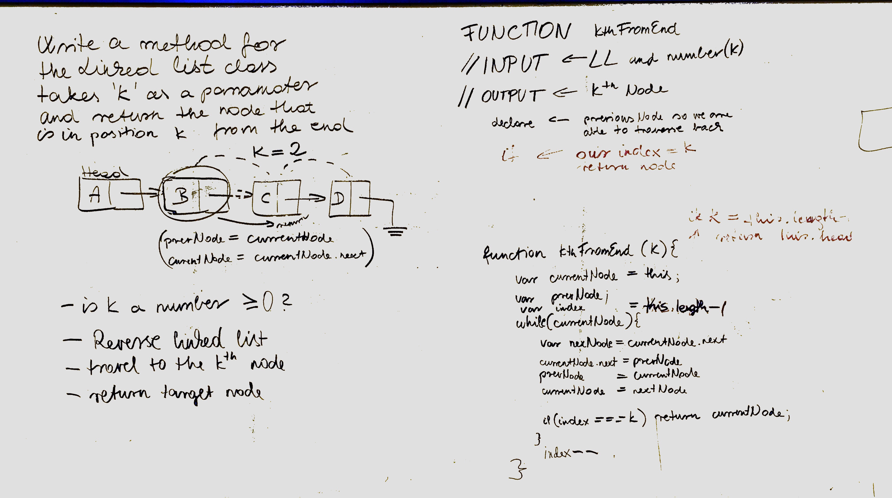

# kth from the end of a Linked List

<!-- Short summary or background information -->
* Write a method for the Linked List class which takes a number, k, as a parameter. Return the node that is k from the end of the linked list. You have access to the Node class and all the properties on the Linked List class as well as the methods created in previous challenges. 

## Challenge
<!-- Description of the challenge -->
* The most challenging part were the tests and also trying to traverse the linked list backwards all while incrementing the index to match the Kth index. For the whiteboard Big O, if the passed in K value is the linked list length-1, the Big O is O(1), otherwise it is O(n).

## Solution
<!-- Embedded whiteboard image -->

** Please include the Linked List and Node javascript files found at the root of this directory **