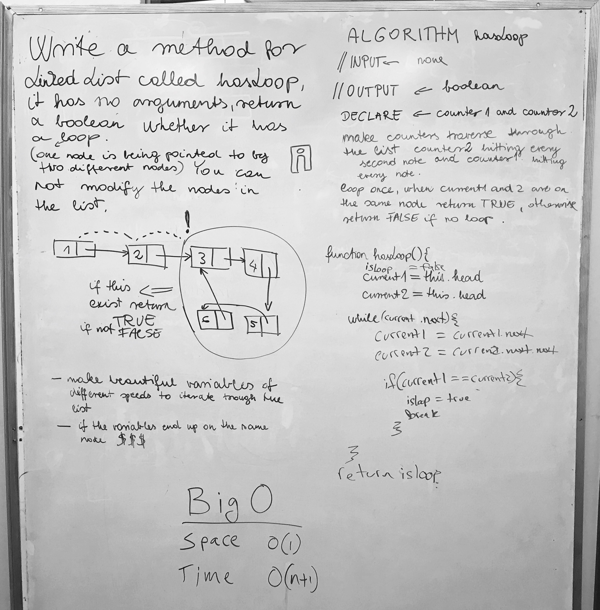

# Identify a Circular Reference
<!-- Short summary or background information -->
* The whiteboard was in collaboration with Jenn, Jason and Timea. This whiteboard challenge definately made me think hard for the solution but ultimately the solution seemed simpler than i was making it out to be. We wrote a function that had a while-loop that checked the current node and the next node and if they ever matched then we found a loop. Otherwise, if we reach a node without a next node, then we have found a non-loop linked list.

## Challenge
<!-- Description of the challenge -->
* Write a method for the Linked List class called hasLoop which takes no arguments. Return a boolean that indicates whether or not a circular reference or loop is present in the linked list. Your implementation must not use any additional memory or modify the nodes of the linked list. You have access to the Node class and all the standard properties on the Linked List class as well as the methods created in previous challenges.
* Note: Length or Size are *not* included in standard properties for a LL.

## Solution
<!-- Embedded whiteboard image -->

** Please include the Linked List and Node javascript files found at the root of this directory **