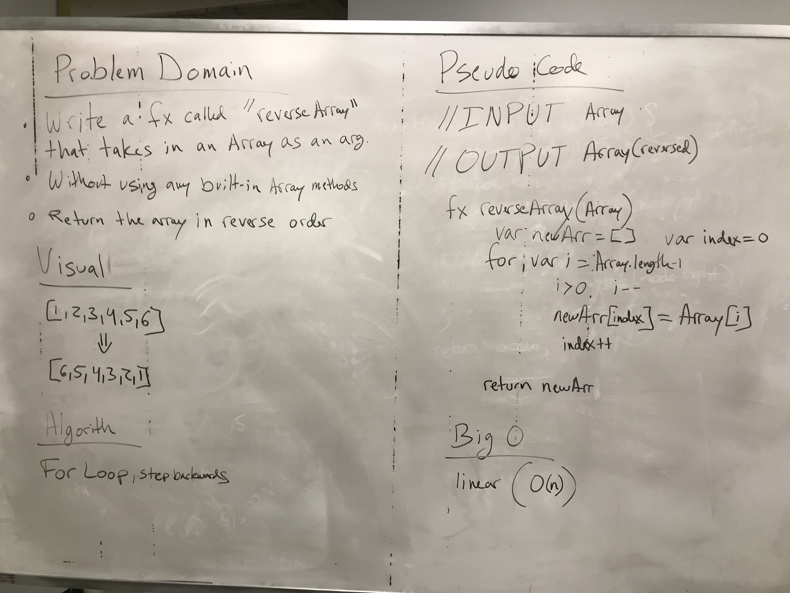

# Reverse an Array
<!-- Short summary or background information -->
* Write a function called reverseArray which takes an array as an argument. Without utilizing any of the built-in methods available to your language, return the provided array argument with elements in reversed order.

## Challenge
<!-- Description of the challenge -->
* The biggest challenge during this whiteboard assignment was trying to figure out to append an element to an array without using the built-in Push() method. Creating a variable to store the index and incrementing it for each time we moved through the inputArray was the easiest solution around that. After which, the rest of the assignment was easy :)

## Solution
<!-- Embedded whiteboard image -->
