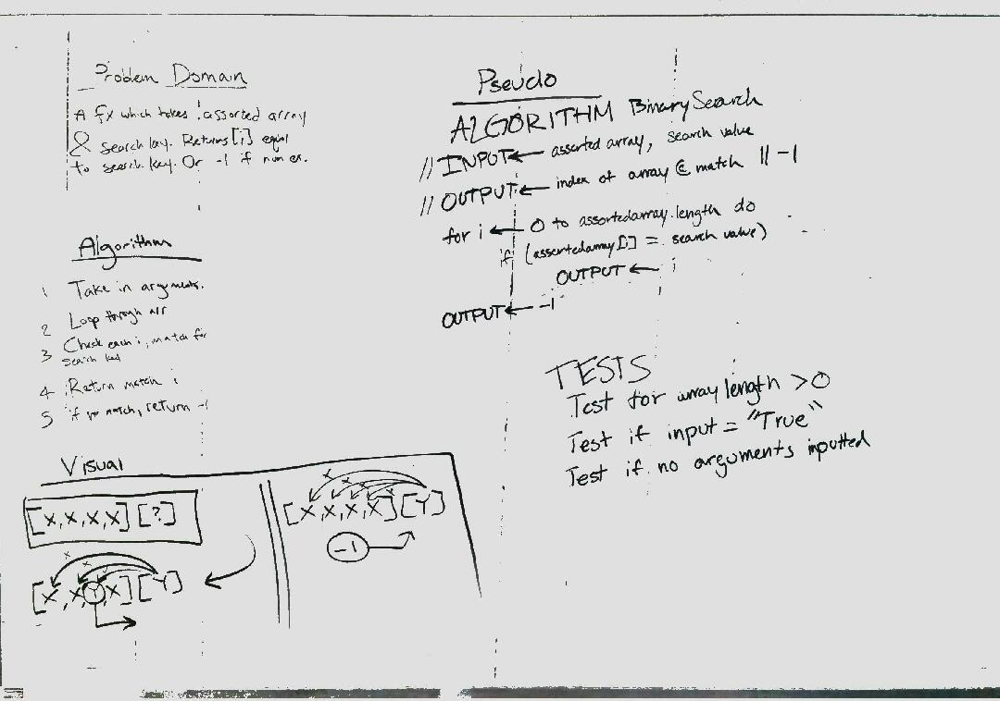

# Insert and shift middle index of array

<!-- Short summary or background information -->
* Write a function called BinarySearch which takes in 2 parameters: a sorted array and the search key. Without utilizing any of the built-in methods available to your language, return the index of the array’s element that is equal to the search key, or -1 if the element does not exist.

## Challenge
<!-- Description of the challenge -->
* The most challenging part of this white board was the halving the array and using that new sliced array as the new input array to recursively slice until you found your value.

## Solution
<!-- Embedded whiteboard image -->
