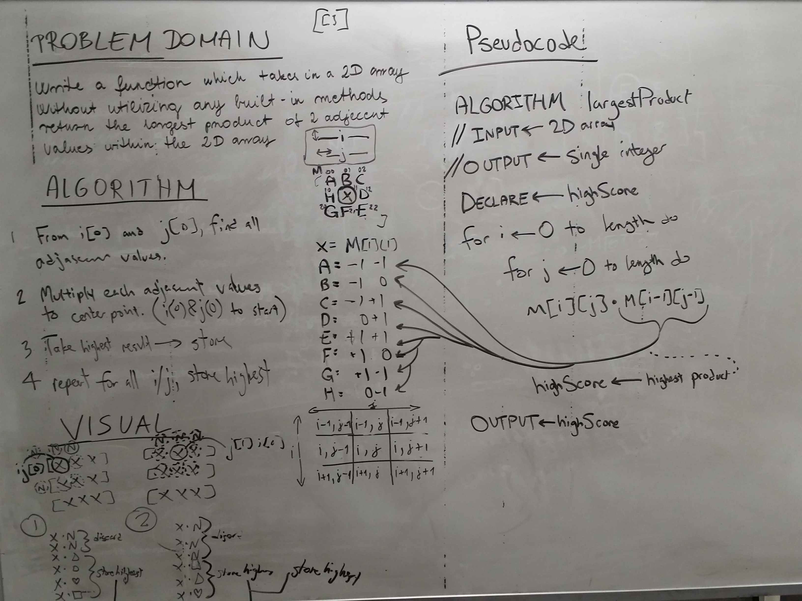

# Largest product of 2 adjacent values in a 2D array
<!-- Short summary or background information -->
* This assignment was hard to rotate through the 2d array. I worked with Timea and Jason on the whiteboard. We did some paired programming to figure out the solution, after prototying the solution using hardcoded values, i rewrote the solution using a few for loops. The Big-O for my solution is O(n3);

## Challenge
<!-- Description of the challenge -->
* Write a function called LargestProduct which takes in a 2D array, of arbitrary size.
* Without utilizing any of the built-in methods available to your language, return the largest product of 2 adjacent values within the 2D array.
* Adjacent values might be horizontally, vertically, or diagonally connected.

## Solution
<!-- Embedded whiteboard image -->
