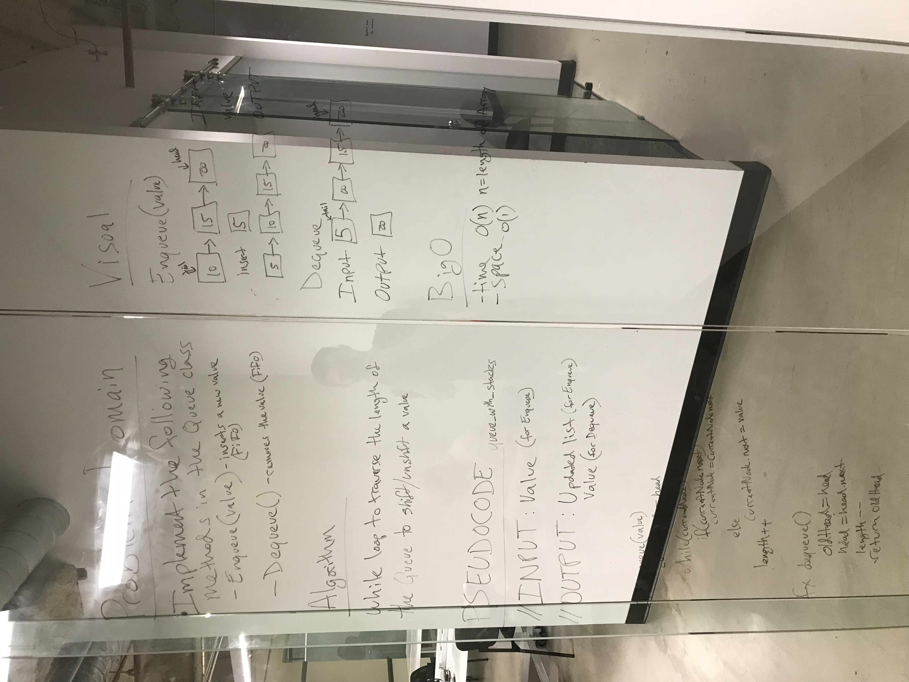

# Implement a Queue using two Stacks.
<!-- Short summary or background information -->
In this challenge we are implementing a Queue and have access to push/pop from a stack. The most challenging part of this whiteboard was using a stack for the Queue, the Pop was diffifult due to breaking my tests but working in normal code. 

## Challenge
<!-- Description of the challenge -->

Implement the following methods for the Queue class:

* enqueue(value) which inserts value into the Queue using a first-in, first-out approach.
* dequeue() which extracts a value from the Queue using a first-in, first-out approach.
You have access to 2 Stack instances with push and pop methods.

## Solution
<!-- Embedded whiteboard image -->


To run tests, install Jest and run navigating to the directory and running ```npm test```