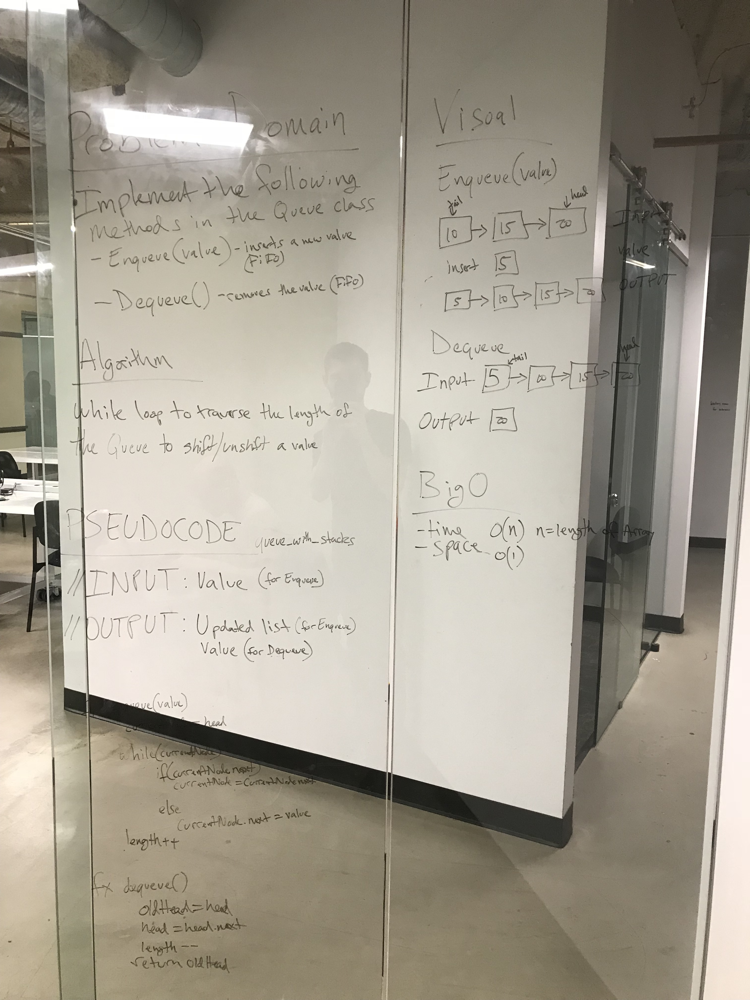

# Implement a Queue using two Stacks.
<!-- Short summary or background information -->
Implement the following methods for the Queue class:

* enqueue(value) which inserts value into the Queue using a first-in, first-out approach.
* dequeue() which extracts a value from the Queue using a first-in, first-out approach.
You have access to 2 Stack instances with push and pop methods.

## Challenge
<!-- Description of the challenge -->

## Solution
<!-- Embedded whiteboard image -->
