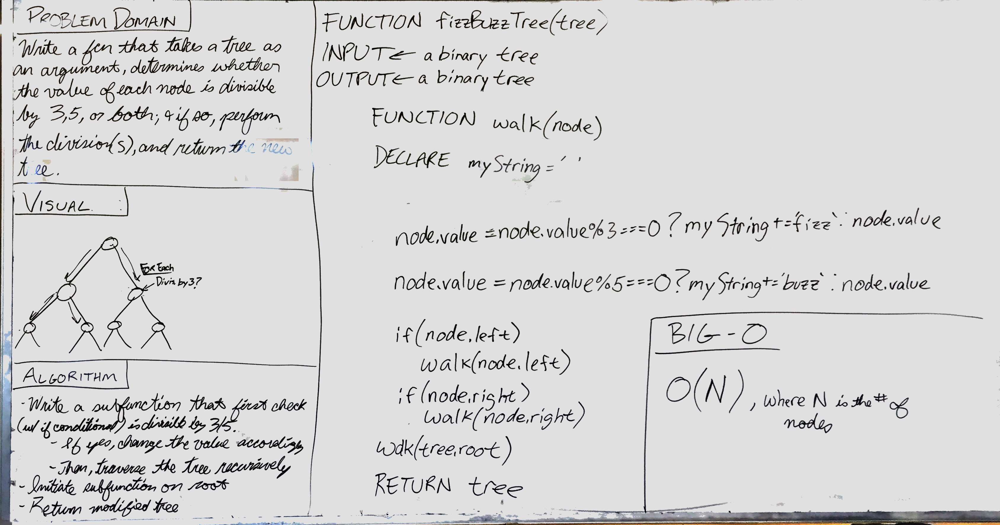

# FizzBuzz Tree
[](https://travis-ci.com/OviParasca/data-structures-and-algorithms)

## Challenge
<!-- Description of the challenge -->
* Write a function called FizzBuzzTree which takes a tree as an argument.
* Without utilizing any of the built-in methods available to your language, determine weather or not the value of each node is divisible by 3, 5 or both, and change the value of each of the nodes respectively. Return the tree with it’s news values.

## Solution
<!-- Embedded whiteboard image -->


To run tests, install Jest and run navigating to the directory and running ```npm test```