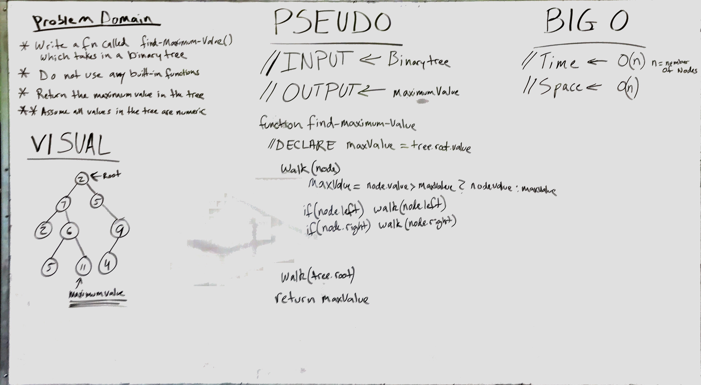

# Find the Maximum Value in a Binary Tree
[](https://travis-ci.com/OviParasca/data-structures-and-algorithms)

<!-- Short summary or background information -->
* Write a function called ```find-maximum-value``` which takes binary tree as its only imput. Without utilizing any of the built-in methods available to your language, return the maximum value stored in the tree. You can assume that the values stored in the Binary Tree will be numeric.


## Challenge
<!-- Description of the challenge -->

INPUT


OUTPUT
```11```


## Solution
<!-- Embedded whiteboard image -->


To run tests, install Jest and run navigating to the directory and running ```npm test```
