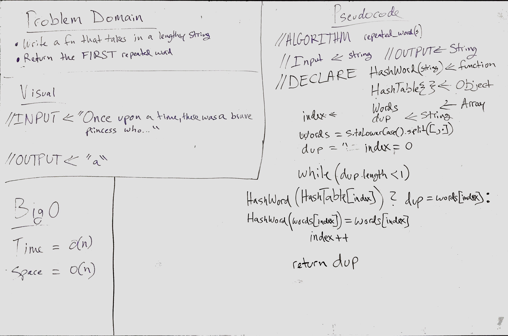

# First repeated word
[](https://travis-ci.com/OviParasca/data-structures-and-algorithms)

## Challenge
<!-- Description of the challenge -->
* Write a function that accepts a lengthy string parameter.
* Without utilizing any of the built-in library methods available to your language, return the first word to occur more than once in that provided string.

## Solution
<!-- Embedded whiteboard image -->


To run tests, install Jest and run navigating to the directory and running ```npm test```
