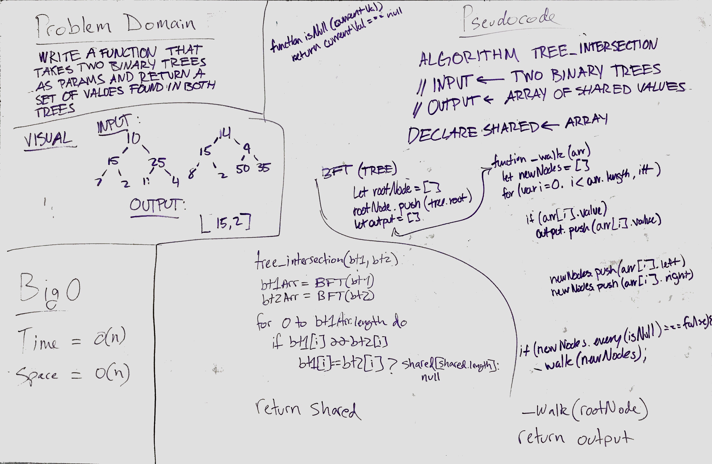

# Tree Intersection
[](https://travis-ci.com/OviParasca/data-structures-and-algorithms)

<!-- Short summary or background information -->
* Write a function called tree_intersection that takes two binary tree parameters.
* Without utilizing any of the built-in library methods available to your language, return a set of values found in both trees.


## Challenge
<!-- Description of the challenge -->

`INPUT`


`OUTPUT` `[100,160,125,175,200,300,350,500]`


<br/>
<br/>
## Solution

<!-- Embedded whiteboard image -->


To run tests, install Jest and run navigating to the directory and running ```npm test```
