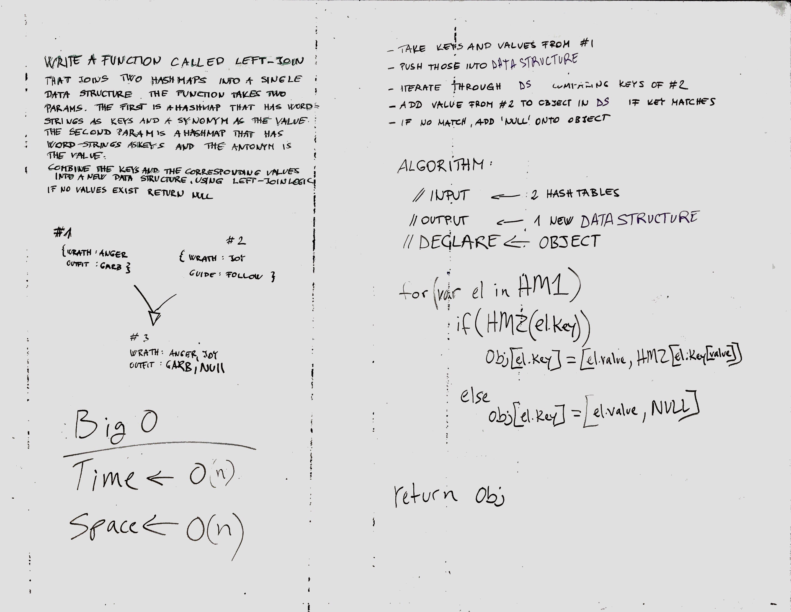

# LEFT JOIN for 2 Hashmaps.

<!-- Short summary or background information -->
* Write a function that LEFT JOINs two hashmaps into a single data structure.
* The first parameter is a hashmap that has word strings as keys, and a synonym of the key as values.
* The second parameter is a hashmap that has word strings as keys, and antonyms of the key as values.
* Combine the key and corresponding values (if they exist) into a new data structure according to LEFT JOIN logic.
* LEFT JOIN means all the values in the first hashmap are returned, and if values exist in the “right” hashmap, they are appended to the result row. If no values exist in the right hashmap, then some flavor of NULL should be appended to the result row.
* The returned data structure that holds the results is up to you. It doesn’t need to exactly match the output below, so long as it achieves the LEFT JOIN logic.
* Avoid utilizing any of the library methods available to your language.

## Challenge
<!-- Description of the challenge -->

`EXAMPLE`

 

## Solution

<!-- Embedded whiteboard image -->

To run tests, install Jest and run navigating to the directory and running `npm test`

### The unit tests are:
* test if the synonym & antonym tables are hashed
* test if the synonym & antonym tables values are objects
* test to see if each value has 2 values for each key
