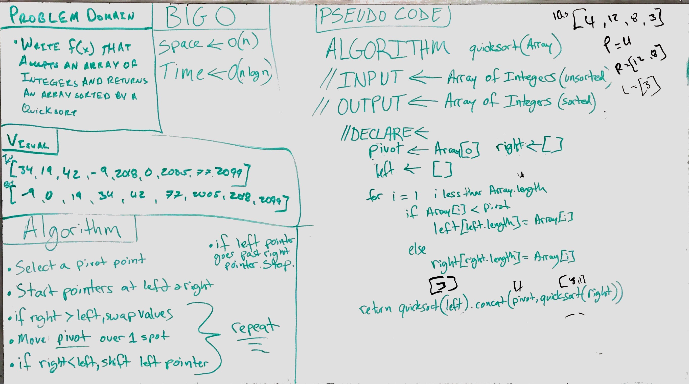

# Mergesort

## Challenge
<!-- Description of the challenge -->
* Write a function that accepts an array of unsorted integers, and returns a sorted array by a recursive quicksort algorithm.

  `INPUT`

  `[34, 19, 42, -9, 2018, 0, 2005, 77, 2099]`

  `OUTPUT`

  `[-9, 0, 19, 34, 42, 77, 2005, 2018, 2099]`

## Solution
<!-- Embedded whiteboard image -->

To run tests, install Jest and run navigating to the directory and running `npm test`