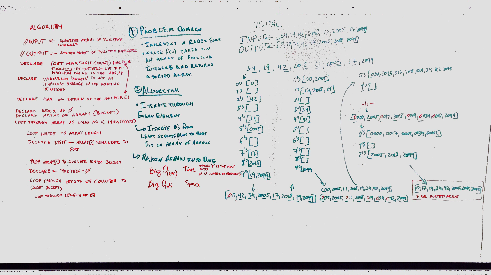

# Radix Sort

<!-- Short summary or background information -->

## Challenge
<!-- Description of the challenge -->
* Write a function that accepts an array of <i>positive</i> integers, and returns an array sorted by a radix sort algorithm.

  <b>EXAMPLE</b>

  INPUT

  `[34, 19, 42, 2018, 0, 2005, 77, 2099]`

  OUTPUT

  `[0, 19, 34, 42, 77, 2005, 2018, 2099]`

 

## Solution

<!-- Embedded whiteboard image -->

To run tests, install Jest and run navigating to the directory and running `npm test`

### The unit tests are:
* Test for empty array
* Test happy path
* Test for already sorted array
